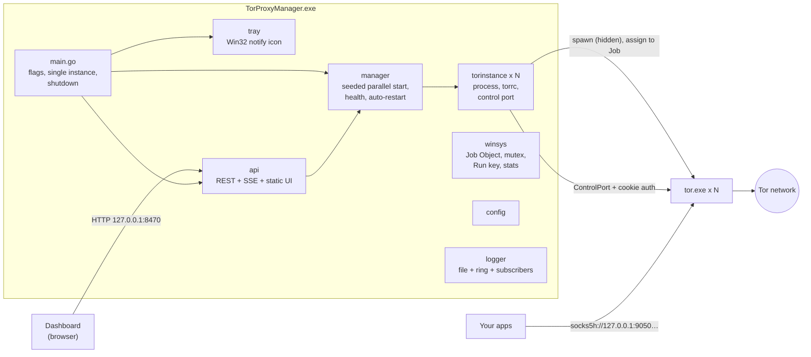

# TorProxyManager

**TorProxyManager.exe** runs and supervises a pool of independent Tor processes on Windows. Each process exposes its own local SOCKS5 endpoint:

```
127.0.0.1:9050  127.0.0.1:9051  127.0.0.1:9052  …  127.0.0.1:9249   (200 by default, up to 500)
```

Each endpoint has its own Tor circuits, so its exit IP is independent of the others. A local web dashboard and a system-tray icon let you start, stop, restart, test and rotate identities on every endpoint. Everything is a single, dependency-free Go executable, plus the official Tor Expert Bundle.

---

## Features

| Area | What you get |
|---|---|
| **Endpoints** | Start port and count are configurable (1–500; the default is 200, and 300 is supported). SOCKS ports bind to loopback only. |
| **Fast startup** | A seed instance bootstraps first, then its directory cache (certs + microdescriptors) is copied to the other instances. The rest start in parallel, bounded by `startup_concurrency`. This turns 200 consensus downloads into one. |
| **Supervision** | An instance only counts as ready when its SOCKS port is open **and** Tor reports `BOOTSTRAP PROGRESS=100` on the control port. Crashed instances are auto-restarted with exponential backoff, and periodic health checks run against every endpoint. |
| **No orphans** | Every `tor.exe` runs inside a Windows **Job Object** with *kill-on-close*. If the manager crashes or is killed, Windows terminates its children. Leftovers from older sessions are found through PID files and terminated, but only if they really are `tor.exe`. |
| **Control** | Per instance: restart, stop/start, **New Identity** (`SIGNAL NEWNYM`), verify via check.torproject.org, view the Tor log. In bulk: start all, stop all, restart failed, new identity for all, verify all. |
| **Dashboard** | Dark glass UI over a live SSE stream: stat cards, a filterable and sortable endpoint table, a 300-cell heatmap, an activity log, a settings editor with validation, proxy-list export (TXT/JSON/`socks5h://`), diagnostics export, and an isolated-profile browser launcher. |
| **Tray** | Status-coloured onion icon (grey stopped, violet starting, green healthy, amber degraded, red error). The tooltip shows counts. The right-click menu has Open Dashboard / Copy Proxy List / Start / Stop / Restart Failed / New Identity / Exit. Balloon notifications appear when startup finishes or fails. |
| **Windows integration** | Single instance (launching again just opens the dashboard), optional *Start with Windows* (HKCU Run key, no admin needed), and a GUI build plus a console build for servers and scripting. |
| **Security** | Loopback-only listeners; Host-header allow-list (DNS-rebinding defence); CSRF header and Origin check on every state-changing request; no CORS; strict CSP with no inline script or style; no external assets; the browser executable path is never taken from HTTP input; secrets are redacted from logs. |

---

## Quick start

1. **Get the app.** Download a release zip, or build it yourself (see [Building](#building)).
2. **Get Tor.** In the app folder, run:
   ```powershell
   powershell -ExecutionPolicy Bypass -File .\scripts\download-tor.ps1
   ```
   This fetches the latest official *Tor Expert Bundle* from `dist.torproject.org` and verifies its SHA-256. If `gpg` is installed it also verifies the OpenPGP signature. The bundle is extracted to `tor\tor\tor.exe`.
   TorProxyManager also finds an existing **Tor Browser** install automatically, or you can set `tor_executable_path`.
3. **Run** `TorProxyManager.exe`. The dashboard opens at <http://127.0.0.1:8470/>. Click **Start All**.
4. **Use the proxies.** Always use **`socks5h://`** so DNS is resolved by Tor and not leaked locally:
   ```powershell
   curl.exe --proxy socks5h://127.0.0.1:9050 https://check.torproject.org/api/ip
   curl.exe --proxy socks5h://127.0.0.1:9051 https://check.torproject.org/api/ip   # different exit
   ```
   ```python
   import requests
   proxies = {"http": "socks5h://127.0.0.1:9073", "https": "socks5h://127.0.0.1:9073"}
   print(requests.get("https://check.torproject.org/api/ip", proxies=proxies, timeout=60).json())
   ```

> **Tip:** Tor's default `IsolateSOCKSAuth` gives each distinct SOCKS username/password pair its own circuit. This means a single endpoint can provide even more isolated circuits.

---

## Command line

`TorProxyManager.exe` is a GUI-subsystem binary. When launched from a terminal it attaches to that console for output. `TorProxyManager-console.exe` is identical but is a console application, which suits services, schedulers and CI.

```
TorProxyManager.exe [flags]

  --config PATH        config file (default: <exe dir>\config.json)
  --headless           no tray, no browser, start all endpoints; run until Ctrl+C
  --start              start all endpoints at launch (overrides auto_start)
  --no-tray            do not create the tray icon
  --no-browser         do not open the dashboard on launch
  --endpoints N        override endpoint_count for this run
  --start-port N       override start_port for this run
  --web-port N         override web_ui_port for this run
  --log-level LEVEL    debug | info | warn | error
  --list-proxies       print socks5h:// URLs for the configured range and exit
  --check-config       validate config, locate tor.exe, check every port; exit 1 on problems
  --version            print version and exit
```

Examples:

```powershell
.\TorProxyManager-console.exe --headless --endpoints 300
.\TorProxyManager-console.exe --list-proxies > proxies.txt
.\TorProxyManager-console.exe --check-config
```

Overrides apply to the current run only. They are written to `config.json` only if you then save settings from the dashboard.

---

## Configuration

`config.json` sits next to the executable. It is created on first run from `configs\default_config.json`. Every option can also be edited in **Settings** on the dashboard, which validates values before saving. Changes to ports and other Tor options take effect on the next **Start All** (the dashboard tells you when a restart is needed).

| Key | Default | Description |
|---|---|---|
| `start_port` | `9050` | First SOCKS5 port. |
| `endpoint_count` | `200` | Number of Tor instances / SOCKS ports (1–500). |
| `control_port_start` | `30050` | First control port (one per instance; must not overlap the SOCKS range). |
| `bind_address` | `127.0.0.1` | SOCKS bind address. **Must be loopback** (`127.0.0.1`, `::1`, `localhost`). |
| `tor_executable_path` | `""` | Explicit `tor.exe`. Empty means auto-detect: `tor\tor.exe`, `tor\tor\tor.exe`, app dir, Tor Browser, Program Files. |
| `torrc_template_path` | `""` | Custom torrc template. Empty means `configs\torrc.template` if present, otherwise the built-in template. |
| `data_directory` | `""` | Per-instance Tor data. Empty means `<app>\data`. |
| `log_directory` | `""` | Application logs. Empty means `<app>\logs`. |
| `startup_concurrency` | `10` | Instances bootstrapping in parallel (1–50). |
| `connection_timeout_seconds` | `30` | Socket and control-port timeouts. |
| `bootstrap_timeout_seconds` | `300` | Maximum time for one instance to reach 100 % bootstrap. |
| `health_check_interval_seconds` | `60` | Interval between SOCKS handshake health checks. |
| `retry_limit` | `5` | Start attempts per instance before it is marked *failed*. |
| `retry_backoff_seconds` / `retry_backoff_multiplier` / `retry_max_backoff_seconds` | `5` / `2.0` / `300` | Exponential backoff between attempts. |
| `auto_restart` | `true` | Restart instances whose process exits unexpectedly. |
| `seed_directory_cache` | `true` | Bootstrap one instance, then share its directory cache. |
| `auto_start` | `false` | Start all endpoints when the app launches. |
| `start_with_windows` | `false` | Register under `HKCU\…\Run` (launches with `--autostart`, minimised to tray). |
| `open_dashboard_on_launch` | `true` | Open the dashboard in the default browser on launch. |
| `enable_tray` | `true` | Show the notification-area icon. |
| `minimize_to_tray` | `false` | Reserved for UI behaviour. |
| `browser_path` | `""` | Browser used by *Launch browser via endpoint*. Empty means auto-detect Firefox, Chrome, Edge or Brave. |
| `web_ui_port` | `8470` | Dashboard port (always bound to 127.0.0.1). Requires an app restart. |
| `log_level` | `info` | `debug` / `info` / `warn` / `error`. |
| `log_max_size_mb` / `log_max_files` | `10` / `5` | Log rotation. |

### torrc template

`configs\torrc.template` is rendered for every instance using Go `text/template`. The available fields are `{{.InstanceID}}`, `{{.SocksPort}}`, `{{.ControlPort}}`, `{{.BindAddress}}`, `{{.DataDir}}` and `{{.LogFile}}`. You can add Tor options there (exit-country selection, bridges/pluggable transports, `MaxCircuitDirtiness`, …). The template documents which lines are required.

---

## Resource planning

| Endpoints | RAM (typical) | First start (seeded cache) | Notes |
|---|---|---|---|
| 50 | ~1.3–1.5 GB | 1–2 min | |
| 200 | ~5–6 GB | 3–6 min | default |
| 300 | ~8–9 GB | 5–10 min | raise `startup_concurrency` on fast machines |

Each Tor client uses roughly **25–30 MB** of RAM once bootstrapped, with little CPU when idle. Later starts are faster because each instance keeps its own cache in `data\instance_N`. Starting hundreds of clients at once puts load on the Tor network. Seeding and bounded concurrency keep that load polite, so please don't set concurrency higher than you need.

---

## Dashboard and HTTP API

The dashboard is served at `http://127.0.0.1:<web_ui_port>/`. You can script against the same JSON API. Every **POST** must send the header `X-TPM-Request: 1`, and requests must use a loopback `Host`.

| Method | Path | Purpose |
|---|---|---|
| GET | `/api/status` | Overall status (counts, ports, memory, uptime, Tor version). |
| GET | `/api/instances` · `/api/instances/{id}` | Per-instance status. |
| GET | `/api/instances/{id}/log` | Tail of that instance's Tor log. |
| POST | `/api/instances/{id}/{restart\|start\|stop\|newnym\|test}` | Per-instance actions. |
| POST | `/api/start` · `/api/stop` · `/api/restart-failed` · `/api/newnym-all` | Bulk lifecycle. |
| POST / GET | `/api/test-all` | Run, or read the last results of, verification through check.torproject.org. |
| GET / POST | `/api/config` · GET `/api/config/defaults` | Read or update settings (partial JSON; validated; unknown keys rejected). |
| GET | `/api/proxies?format=url\|json&running=1&download=1` | Proxy list export. |
| GET | `/api/diagnostics` · `/api/diagnostics/export?format=json\|text` | Diagnostic report. |
| GET | `/api/logs?after=SEQ&limit=N` | Application log ring buffer. |
| GET | `/api/browsers` · POST `/api/browser/launch` `{"port":9050}` | Detect browsers / launch an isolated profile through one endpoint. |
| GET | `/api/events` | Server-Sent Events: `snapshot`, `status`, `instances`, `log`, `event`. |
| POST | `/api/shutdown` | Graceful application exit. |

```powershell
$h = @{ 'X-TPM-Request' = '1' }
Invoke-RestMethod http://127.0.0.1:8470/api/status | Select-Object -Expand status
Invoke-RestMethod -Method Post -Headers $h http://127.0.0.1:8470/api/instances/12/newnym
Invoke-RestMethod -Method Post -Headers $h -ContentType application/json `
  -Body '{"endpoint_count":300}' http://127.0.0.1:8470/api/config
```

---

## Architecture



The source layout:

```
main.go                     entry point, CLI, lifecycle, tray wiring
internal/config             settings model, validation, atomic persistence
internal/torinstance        one Tor process: torrc, launch, bootstrap, control protocol, retries
internal/manager            the pool: seeded start, bounded concurrency, health loop, events
internal/health             SOCKS5 handshake checks, check.torproject.org verification
internal/api                HTTP server, security middleware, SSE broadcaster
internal/diagnostics        JSON / text diagnostic reports
internal/browser            browser detection + isolated-profile launch through an endpoint
internal/tray               notification-area icon (raw Win32, no CGO)
internal/winsys             Job Objects, mutex, Run key, process stats, clipboard
internal/logger             leveled, rotating, redacting logger with live subscribers
internal/testutil/faketor   a fake tor.exe used by the test-suite
web/                        dashboard (embedded into the exe via go:embed)
configs/                    default config + torrc template
scripts/                    build.ps1, download-tor.ps1
```

---

## Building

Requirements: **Go 1.22+** (developed with Go 1.26) on Windows 10/11. The build uses no CGO and no C compiler.

```powershell
.\scripts\build.ps1                 # vet + tests + icon/version resources + both exes -> dist\TorProxyManager\
.\scripts\build.ps1 -Zip            # also dist\TorProxyManager-<ver>-windows-amd64.zip
.\scripts\build.ps1 -Zip -IncludeTor   # bundle the verified Tor Expert Bundle into the release
.\scripts\build.ps1 -SkipTests -NoResources   # fastest local build
```

The version comes from `VERSION` (or `-Version X.Y.Z`) and is stamped into both the binary and its Windows version resource. `dist\SHA256SUMS.txt` lists the hashes of all artefacts.

Manual build:

```powershell
go test ./...
go build -trimpath -ldflags "-s -w -H windowsgui -X torproxymanager/internal/api.AppVersion=1.0.0" -o TorProxyManager.exe .
```

### Tests

```powershell
go test ./...            # ~40 s: unit tests + lifecycle tests against faketor (dozens of real processes)
go test -race ./...      # needs CGO / gcc for the race detector
```

The suite covers config validation and persistence, the logger (rotation, redaction, subscribers), the control protocol, the instance lifecycle (bootstrap, failure, crash and auto-restart, shutdown timeout and kill, retry), the manager (seeded start, stop during start, stale-process cleanup, port conflicts), health checks, API security (Host / CSRF / Origin / CSP), config validation over HTTP, proxy export, SSE, diagnostics, the tray icon renderer and the torrc templates.

---

## Security and privacy notes

- **Loopback only.** SOCKS, control and dashboard listeners all bind to loopback, and validation refuses public bind addresses. Do not expose these ports to a LAN with port forwarding: an open SOCKS proxy will be abused.
- **Use `socks5h://`** (or your client's "proxy DNS" option). Plain `socks5://` resolves hostnames locally and leaks DNS.
- **The control ports** use per-instance cookie authentication and accept only single-line commands.
- **Not a Tor Browser replacement.** Proxying a normal browser through Tor does not give you Tor Browser's fingerprinting protections. The *Launch browser* feature uses a throw-away, isolated profile with WebRTC disabled and remote DNS, but it is still meant for testing.
- **Respect the network.** Running hundreds of clients is legitimate for testing and research, but avoid needlessly rotating identities in tight loops.
- **Diagnostics exports** include settings and file paths (which can contain your Windows username), but never the hostname. Review them before sharing.

---

## Troubleshooting

| Symptom | Fix |
|---|---|
| "tor.exe not found" | Run `scripts\download-tor.ps1`, or set `tor_executable_path`. |
| "N port conflict(s)" | Another program (or another Tor) uses those ports. Change `start_port` / `control_port_start`, or run `--check-config` to list them. |
| "Cannot start dashboard" | Port 8470 is busy. Change `web_ui_port` in `config.json`. |
| Instances stuck at *bootstrapping* | The network blocks Tor? Configure bridges in `configs\torrc.template`. Check the instance log in the dashboard drawer. |
| Many instances *failed* after start | Lower `startup_concurrency`, raise `bootstrap_timeout_seconds`, then use **Restart Failed**. |
| Antivirus quarantines `tor.exe` | Add an exclusion for the app folder. Tor is commonly flagged heuristically. |
| Nothing happens when launching again | By design, the second launch opens the existing dashboard. Look for the tray icon. |

Logs: `logs\torproxymanager.log` (application) and `data\instance_N\tor.log` (per Tor instance). Use **Diagnostics → Export** in the dashboard when you report issues.

---

## License

MIT (see [LICENSE](LICENSE)). Tor is a separate project, © The Tor Project, distributed under its own license.
"# TorProxy" 
"# TorProxy" 
